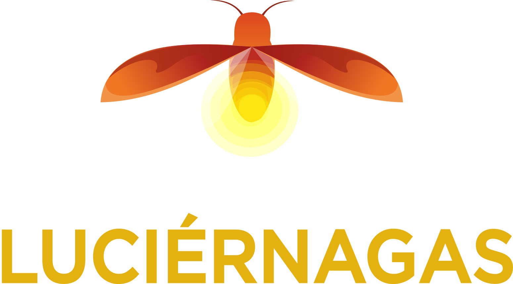

# Festival Internacional de las Luciérnagas

<p align="center">
   
</p>

Página web desarrollada con Django como proyecto final para la materia de Ingeniería de Software.

## Integrantes

| Nombre                           | Rol                                      |
|----------------------------------|------------------------------------------|
| Apis Lorenzana Said              | Product Owner, Backend Lead     |
| Hernández García Oscar Yahir     | SCRUM Master, UI/UX Designer, Frontend Dev|
| Sandoval Sandoval Gerardo Gael   | Backend Dev  |
| Flores Doniz Daniel              | QA, DevOps                               |
| Espino Gutiérrez Alejandro       | Backend Dev                        |

## Demostración en Vivo

La aplicación ya cuenta con un despliegue disponible para que se pueda probar sin necesidad de
instalar ninguna dependencia.

- ¡Página en vivo del [Festival Internacional de las Luciérnagas](https://luciernagas2026-tg3o.onrender.com/)!

## Ejecución Local

Si así lo prefieres, también puedes ejecutar nuestro proyecto desde tu máquina local.
Siéntete libre de explorar los archivos de nuestro proyecto para visualizar cómo está construído.

A continuación se muestra una guía breve de cómo ejecutar este proyecto.

> [!WARNING]
> ¡El archivo `.env` de este proyecto no se comparte por razones de seguridad! Al ejecutar en local, algunas funcionalidades pueden verse afectadas o directamente no estar disponibles.
> 

### 1. Instalación de Conda

El proyecto utiliza **Conda** para la gestión de un entorno virtual. 
Es la única dependencia que debe instalarse manualmente y puede obtenerse de manera completamente gratuita:

Descarga **Miniconda** desde la [página oficial](https://www.anaconda.com/download).

Instálalo con las opciones por defecto.

Para verificar la instalación, abre una terminal y ejecuta:

```bash
conda --version
```

---

### 2. Clonar el repositorio

1. Descarga o clona este repositorio en tu máquina local.
2. Abre una terminal y navega hasta la carpeta del proyecto.

```bash
cd <tu_ruta_al_proyecto>/LambdaSW-Fireflies_project
```

---

### 3. Crear y activar el entorno virtual

Instala las dependencias del proyecto (este comando solo se ejecuta una vez):

```bash
conda env create -f environment.yml
```

Activa el entorno virtual:

```bash
conda activate CondaProjectoF
```

A partir de este punto, la terminal debe mostrar `(CondaProjectoF)` al inicio de la línea, indicando que el entorno está activo.  
Cada vez que abras una nueva terminal para trabajar con el proyecto, deberás ejecutar nuevamente este comando.

---

### 4. Migrar la base de datos

Ejecuta las migraciones para inicializar la base de datos:

```bash
python manage.py migrate
```

---

### 5. (Opcional) Crear un usuario administrador

Si necesitas acceso al panel de administración ejecuta el comando:

```bash
python manage.py createsuperuser
```

Y sigue las instrucciones en terminal para registrar el nuevo usuario.

---

### 6. Ejecutar el servidor

Inicia el servidor de desarrollo:

```bash
python manage.py runserver
```

Cuando aparezca el mensaje indicando que el servidor está activo, abre en el navegador:

```
http://127.0.0.1:8000/
```

- Aplicación principal: `http://127.0.0.1:8000`
- Panel de administración: `http://127.0.0.1:8000/admin`

Para detener el servidor usa `Ctrl + C`.

## Pruebas

El proyecto cuenta con una *testsuite* automatizada que puedes ejecutar con:

```bash
pytest
```


